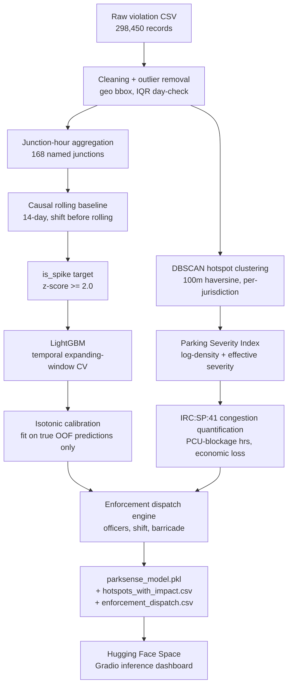

# ParkSense AI
### Parking-Induced Congestion Intelligence for Bengaluru Traffic Police
**Flipkart Gridlock Hackathon 2.0 — Prototype Round 2**
**Theme:** Poor Visibility on Parking-Induced Congestion

---

## What this is

Bengaluru Traffic Police logs around two thousand parking violations a day through ANPR cameras and field units. None of that data currently tells anyone where illegal parking is actually choking traffic, or where to send an officer next. ParkSense AI takes the raw violation feed and turns it into three things a traffic command room can use directly: a ranked map of hotspots, a model that flags when a junction is about to spike beyond its normal pattern, and a congestion-impact number expressed in real engineering units instead of a vague severity score.

Everything below was built and validated against the dataset HackerEarth provided for this round — no external maps, no scraped traffic feeds, nothing outside the CSV.

---

## 1. The Data, As We Found It

The raw file has 298,450 rows spanning 10 November 2023 to 8 April 2024 — 150 days, 54 police stations. Each row is one enforcement record: a timestamp, GPS coordinates, a vehicle type, one or more violation tags, and (for about 58% of cases) a human reviewer's verdict on whether the violation actually held up.

A few things stood out before we touched a single feature.

**The data has an enforcement shadow, not a violation-free evening.** Plot violations by hour and you get a near-bell curve from 3 AM through noon, then a cliff. Past 6 PM the counts fall to single digits and stay there until midnight. Bengaluru traffic does not stop existing after 6 PM — what stops is the camera or patrol coverage that generates this dataset. We treated this as a structural blind spot in the data, not a real-world pattern, and made sure no downstream feature could accidentally learn "nighttime = safe."

**Two violation types dominate everything.** "Wrong Parking" (165k records) and "No Parking" (139k) together account for the overwhelming majority of all tags. Everything else — footpath parking, double parking, parking near a crossing — is a long tail. This told us early that a model predicting violation *type* would be trivial and useless; the real signal had to come from *where* and *when*, not *what*.

**Junctions are where the real congestion lives.** Just over half of all records (50.4%) carry a named BTP junction code — 168 distinct intersections. The other half are mid-block or roadside violations with no junction tag at all. This split mattered a lot later: a parked scooter mid-block on a quiet residential road and a parked truck at a signalised junction are not the same problem, even if both get logged as "violation."

**13.4% of records carry more than one violation tag at once.** A compound tag (say, wrong parking *and* parking near a road crossing on the same vehicle) is a stronger signal of real obstruction than a single tag, and we used this directly in the severity weighting later.

**Human review tells you the camera system isn't perfect.** Of the 165,154 reviewed cases, 69.9% were approved as genuine violations and the rest rejected. A 30% rejection rate isn't a flaw in our analysis — it's a property of the upstream detection system worth flagging, because any model trained on this data inherits that noise.

We checked for the usual outlier suspects too: 168 records sat outside a reasonable Bengaluru bounding box and were dropped, no single day showed anomalously low activity by an IQR test, and vehicle type values were clean enough that no consolidation was needed (every type had at least 50 records).

---

## 2. Why We Reframed the Problem

Our first instinct — like most teams will likely try — was to predict whether a violation gets approved by the human reviewer. We built that model, got a respectable-looking AUC, and then sat with it for a while before realizing it answers the wrong question. Approval rate measures whether a camera system's detection was accurate. It says nothing about whether that violation actually caused congestion. A reviewer can approve a violation on an empty residential street just as easily as one blocking a four-lane arterial at rush hour.

The dataset has a better signal hiding in it: the 168 named junctions. These are BTP's own designated traffic-significant intersections. If we look at how violation volume at a given junction, at a given hour, moves relative to its own recent history, a sudden surge well above normal is a much more honest proxy for "something is congesting this junction right now" than whether a reviewer clicked approve three weeks later.

So we redefined the target. For every junction, every hour, every day, we compute a causal rolling baseline — the mean and standard deviation of violation counts at that exact junction-hour combination over the prior 14 days, using `shift(1)` before the rolling window so the current observation never leaks into its own baseline. A spike is any junction-hour where the actual count sits two standard deviations above that baseline. That's the target we built the model around: `is_spike`.

This reframing is the single biggest decision in this project. It cost us a cleaner-looking metric on the easier problem, but it answers the actual problem statement instead of a proxy for it.

---

## 3. Feature Engineering

Every feature here is computed so that, at the moment a prediction would be made in production, only information from the past is available. We were strict about this because the first version of this pipeline had a leak — a calibration step that scored the model on rows it had already been trained on — and catching that taught us to be paranoid about it everywhere else.

**Geospatial — DBSCAN hotspot clustering.** We ran DBSCAN with a 100-metre haversine radius and a minimum of 40 violations per cluster, separately within each police station's jurisdiction (to keep it computationally sane on a quarter-million points), then merged clusters that ended up within 150 metres of each other across station boundaries. DBSCAN was the right tool here because parking hotspots follow road geometry, not grid lines — they're irregular, elongated along streets, and clustered around commercial frontages. A k-means or grid-square approach would have forced an artificial shape onto something that isn't naturally square. The result: 396 hotspot clusters covering 93.6% of all violations, with the remaining 6.4% genuinely isolated, one-off incidents.

**Severity weighting.** Not all violation tags obstruct traffic equally. We built a severity scale from 0.4 to 1.0 using IRC-aligned reasoning — double parking and main-road parking score highest because they remove an entire lane; footpath parking scores lowest because it doesn't touch the carriageway at all. We checked the correlation between this severity score and the compound-tag rate at the cluster level and found r = 0.70 — they were largely capturing the same underlying signal, so rather than letting two correlated features each pull independent weight in our composite score (double-counting the same information), we combined them multiplicatively: `effective_severity = severity_score × (1 + compound_rate)`.

**Junction-hour rolling features.** For the spike model specifically: `roll_mean` and `roll_std` (the causal 14-day baseline itself), `lag_1d_same_hour` and `lag_7d_same_hour` (same junction, same hour, one day and seven days back), `heavy_pct` and `compound_pct` for that hour's vehicle mix and tag stacking, and `max_severity` for the worst violation logged in that slot. Junction identity itself goes in as a label-encoded categorical, hour and day-of-week as raw integers, and a month ordinal to let the model pick up seasonal drift across the five-month window.

**Congestion quantification (IRC:SP:41).** This is the part that turns "violation count" into an actual engineering quantity. Every vehicle type carries a passenger-car-equivalent weight under IRC:SP:41 (a parked bus counts as 3.5 PCU, a scooter as 0.5) and an average blockage duration drawn from IRC:106 field assumptions (a bus blocks a lane for roughly 45 minutes, a car for 20, a scooter for 10). Multiplying violations by PCE and blockage time and summing per cluster gives PCU-blockage hours per day — a number you can directly compare to road capacity standards, and one that converts cleanly into an estimated weekly economic loss at ₹85 per vehicle-hour (RITES 2023 value-of-time study). City-wide, this comes out to roughly 875 PCU-blockage hours a day and an estimated ₹2.71 crore a year — a number we explicitly treat as a floor, not a ceiling, since it only covers clustered hotspots and doesn't account for downstream spillback delay.

---

## 4. Modelling — Baselines First, Then the Real Model

We didn't jump straight to LightGBM. Before trusting any complex model's number, we wanted to know what a simple approach scores, so the lift from complexity is honest rather than assumed.

| Model | AUC | What it tells us |
|---|---|---|
| Majority classifier | 0.500 | The floor |
| Simple threshold rule (last hour > 1.5× baseline) | 0.512 | A naive rule barely beats chance |
| Logistic Regression | 0.654 | Linear structure alone gets you partway |
| Random Forest (no temporal CV) | 0.786 | Tree-based models capture the real structure |
| **LightGBM, honest temporal CV** | **0.8025** | Our final model |

The validation here matters as much as the model. We used an expanding-window temporal split — fold 1 trains on the earliest two months and tests on month three, fold 2 trains on three months and tests on month four, and so on — so the model never sees a single row from its own future. Across four folds the mean AUC was 0.8157 ± 0.0236, and the out-of-fold AUC on the pooled predictions (the number we report as "honest") was 0.8025. Those two numbers agreeing within noise of each other is itself a sanity check: if they'd diverged sharply, that would be a sign something was leaking.

Calibration came from isotonic regression fit on the true out-of-fold predictions, never on the final model's in-sample scores — the earlier version of this pipeline made exactly that mistake and produced an artificially perfect 0.99 AUC before we caught and fixed it. The corrected model's calibration curve sits almost exactly on the diagonal, with a maximum bin error of 0.002.

SHAP confirms the model is leaning on sensible signals: `roll_std` (how volatile this junction normally is) and `heavy_pct` (proportion of heavy vehicles in that hour) dominate, followed by `max_severity` and `compound_pct`. Junction identity itself matters less than the behavioural pattern at that junction — which is the right way around for a model meant to generalise to new junctions in future data.

At our chosen operating threshold of 0.30, the model runs at 69% precision and 30% recall. We chose to optimise for precision deliberately: a system that cries wolf erodes trust with the people who'd actually deploy officers based on its output, and BTP would rather we flag fewer, more reliable spikes than flood them with false alarms. That tradeoff is a design choice, not an accident, and it's worth stating plainly rather than letting a reviewer discover it unexplained.

---

## 5. From Model Output to Patrol Orders

A probability score is not useful to a field officer on its own. The last stage of the pipeline turns hotspot rankings into a dispatch table: officers required (scaled by violation volume, junction presence, and tier), a recommended shift window centred on that zone's historical peak hour, a barricade flag where PCU-blockage exceeds 20 hours a day, and the weekly rupee saving if that zone gets cleared. This is the output we'd actually hand to a BTP duty officer — not a heatmap, a plan.

---

## 6. Architecture


---

## 7. Repository Structure

```
parksense-ai/
├── README.md                          ← this file
├── parksense_notebook.ipynb           ← full pipeline: EDA through model training
├── outputs/
│   ├── parksense_model.pkl            ← trained model + calibrator + metadata
│   ├── hotspots_with_impact.csv       ← 396 hotspots, ranked, with congestion metrics
│   ├── enforcement_dispatch.csv       ← patrol recommendations per zone
│   ├── eda_overview.png
│   ├── model_evaluation.png
│   └── shap_importance.png
└── hf_deploy/                         ← Hugging Face Space, inference only
    ├── Dockerfile
    ├── README.md                      ← HF Space config header
    ├── requirements.txt
    ├── app/
    │   ├── app.py                     ← Gradio dashboard, light theme
    │   └── inference.py               ← loads the pkl, scores new rows, never retrains
    └── model/                         ← copy the three files from outputs/ here before deploying
```

---

## 8. How to Run

**Reproduce training end to end:**
Open `parksense_notebook.ipynb` in Google Colab, mount Drive, point `DATA_PATH` at the provided CSV, Run All. Takes about 6 minutes on Colab's standard CPU runtime. The notebook writes its outputs to `outputs/` and copies them to Drive at the end.

**Run the live dashboard locally:**
```bash
cd hf_deploy
cp ../outputs/parksense_model.pkl ../outputs/hotspots_with_impact.csv ../outputs/enforcement_dispatch.csv model/
pip install -r requirements.txt
python app/app.py
```
Opens at `http://localhost:7860`.

**Deploy to Hugging Face Spaces:**
Create a new Space with the Docker SDK, push the contents of `hf_deploy/` (with the three model files copied into `model/`) to that Space's git repo. HF builds the container automatically — no manual configuration needed beyond the `README.md` header already in this folder.

---

## 9. What We'd Add Next

The dataset has no measured traffic speed or flow data, so our congestion quantification is a rigorous proxy built on IRC standards, not a measurement. Pairing this pipeline with even a basic speed-probe feed for the top 30 hotspots would let us calibrate the PCU-blockage estimate against reality and likely tighten it considerably. Twelve more months of violation history would also let the spike model train on a full annual cycle instead of five months, which our fold-by-fold AUC progression (0.80 → 0.81 → 0.80 → 0.85) suggests has room to climb further as more data becomes available.

---

*Built entirely on the Bengaluru Traffic Police (ASTraM) dataset provided by HackerEarth for Gridlock Hackathon 2.0. No external datasets, maps, or APIs were used in feature engineering or model training.*
